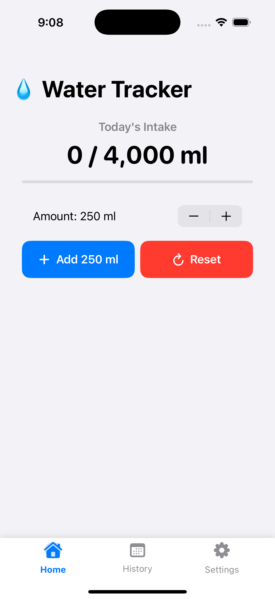
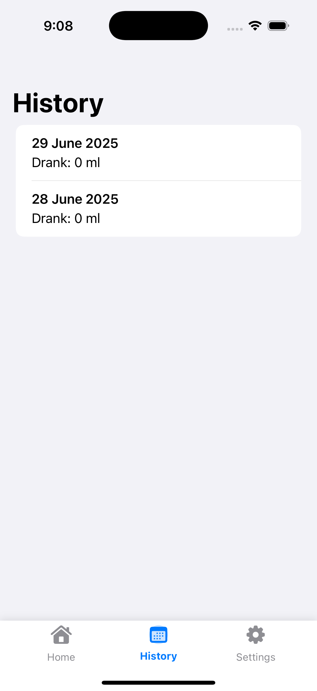
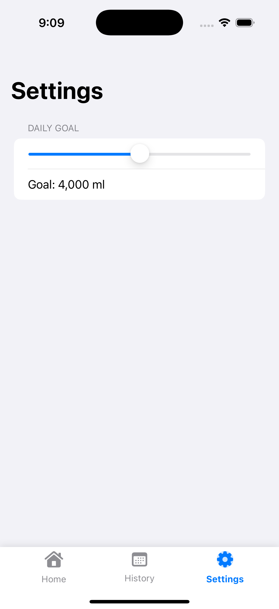

# 💧 WaterTrackerApp

A modern SwiftUI-based water tracking app that helps users stay hydrated with automatic reminders, progress tracking, and goal customization.

## ✨ Features

- ✅ Custom daily water intake goal
- ✅ Beautiful progress view for today's water consumption
- ✅ History tracking of daily intake
- ✅ Stepper to choose custom intake amount
- ✅ Repeating local notifications (every minute) with **custom sound**
- ✅ Modern custom `TabBar` navigation using `NavigationStack` and a central `Router`
- ✅ Persisted state using `@AppStorage` and `UserDefaults`
- ✅ Lightweight SwiftUI architecture with separation of logic

---

## 📲 Screens

| Home | History | Settings |
|------|---------|----------|
|  |  |  |

---

## 🔔 Local Notifications

- Local notifications are scheduled every **minute** using:
  ```swift
  UNTimeIntervalNotificationTrigger(timeInterval: 60, repeats: true)
  ```
- Sound file: `water_ding.wav`
- To replace or customize the sound:
  1. Use `.wav`, `.aiff`, or `.caf` format.
  2. Add it to the app bundle.
  3. Replace filename in:
     ```swift
     content.sound = UNNotificationSound(named: UNNotificationSoundName("water_ding.wav"))
     ```

---

## 📦 Architecture

| Layer       | Responsibility                                 |
|------------|--------------------------------------------------|
| `MainView` | Sets up tab bar and routing                     |
| `Router`   | Manages app-wide navigation and selected tab    |
| `HomeView` | Displays current progress and actions           |
| `WaterDataStore` | Holds goal, today's intake, and history  |
| `NotificationManager` | Schedules local notifications        |
| `CustomTabBar` | A modern SwiftUI tab bar                    |

---

## 🧪 How to Run

1. Clone the repository
2. Open `WaterTrackerApp.xcodeproj`
3. Run on a **real device** (notifications and sound do not work reliably on simulator)
4. Accept notification permissions
5. Water reminder will appear every minute with sound

---

## 🔊 Custom Sound Integration

1. Add your sound file (e.g., `my_sound.wav`) to Xcode
2. Ensure it's added to the **target**
3. Reference it in your notification content:

```swift
content.sound = UNNotificationSound(named: UNNotificationSoundName("my_sound.wav"))
```

---

## 📅 Future Enhancements (Ideas)

- Add dark mode and adaptive color styling
- Add hydration tips and motivational messages
- Show statistics with charts (weekly/monthly)
- iCloud or CoreData syncing
- HealthKit integration (sync with Apple Health)

---

## 🔐 Permissions Used

- `UNUserNotificationCenter` → For scheduling notifications
- `@AppStorage` / `UserDefaults` → To persist user data

---

## 🧑‍💻 Author

**Ibrahim Mohammed Gedami**

- GitHub: [@IbrahimMoGedami](https://github.com/IbrahimMoGedami)
- LinkedIn: [@ibrahimmogedami](https://www.linkedin.com/in/ibrahimmogedami)

---
